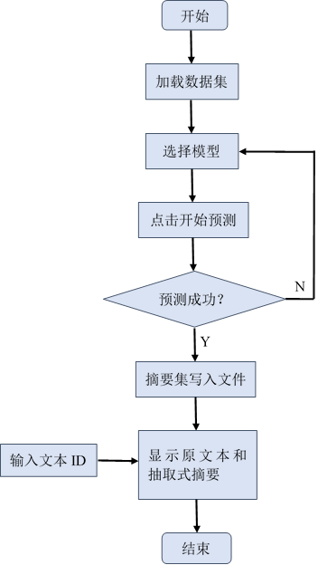

# SUMMARY
A Single Document Extractive Summarization with Satellite and Nuclear Rela-tions

# 软件简介
在信息呈现爆炸式增长的时代，如何从庞大的互联网上获取更有价值的信息成为人们日益关注的重点。自动文摘作为人们高效利用信息的重要武器，一直是自然语言处理领域的一个热点。该软件以基于神经网络的单文档抽取式摘要方法为基础，构建一个篇章主次关系预测和文本摘要任务的联合学习模型，同时考虑字、词级别的篇章语义信息和篇章主次关系等篇章的结构信息，从而抽取出最能代表文档核心内容的句子作为摘要。
本系统主要有三个功能：
(1)	文件功能：主要用于文件数据的读取和显示；
(2)	数据功能：主要是通过主次关系与文本摘要联合学习算法，对数据进行处理，抽取摘要并写入文件；
(3)	展示功能：主要用于反馈模型抽取摘要的效果，方便用户分析数据。

* 该系统的运行界面如图1所示：
  
 
  图1 主界面

* 该系统的设计流程图如图2所示：

  

  图2 设计流程图
